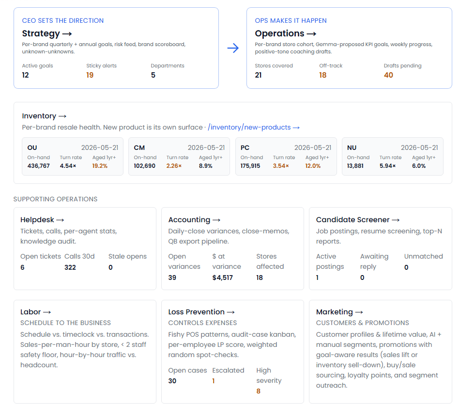
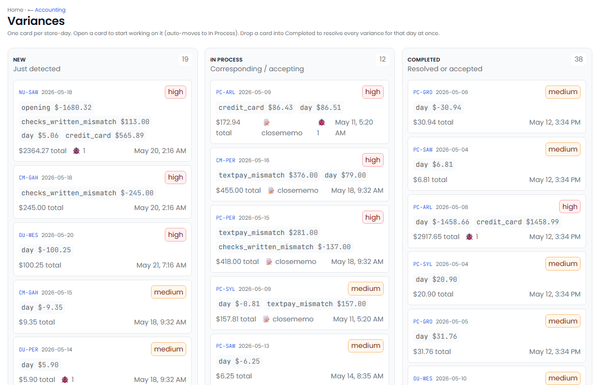

  

<h1 align="center">BackOfficeBoss</h1>

<strong>An AI workforce for your back office.</strong> Everything else is just noise.

---

## What it is

Most back-office software is a filing cabinet. Someone still has to log in, run the report, spot the problem, and chase it down. **BackOfficeBoss flips that around.**

BackOfficeBoss is a team of specialized AI "Bosses" — one for each recurring back-office role. Each Boss reads the same information a person would (the emails, reports, and exports that already land in your inbox every day), applies the same judgment an experienced manager would, and then surfaces **only the things that actually need a human decision.**

No dashboards to go hunting through. No spreadsheets to reconcile by hand. You open one screen in the morning and see exactly what needs your attention — with the *why* and a suggested fix already attached.

> It runs **on your own hardware, inside your own network.** Your data never leaves the building.

> _Screenshot: the home screen — your top-of-mind decisions for the day, ranked and explained._

---

## Why it's different

| | Typical software | BackOfficeBoss |
|---|---|---|
| **Who does the work?** | You do — it just stores data | The AI does the work; you approve it |
| **What you see** | Raw reports and dashboards | Decisions, with the reasoning attached |
| **Where your data lives** | A vendor's cloud | Your office, your network |
| **How it fits your business** | You adapt to the software | The software is built around you |
| **What it costs to grow** | Per-seat fees, forever | Built once, owned for good |

---

## Meet the Bosses

Each Boss replaces or augments a specific back-office role. Click any one to see what it does.

| Boss | Replaces / augments | What it handles |
|---|---|---|
| [**Helpdesk Boss**](helpdesk-boss.md) | Helpdesk manager & agent coach | Reads every ticket and call, scores quality, catches recurring problems |
| [**Accounting Boss**](accounting-boss.md) | Accounting manager & reconciliation clerk | Reconciles daily reports, flags variances within minutes |
| [**HR Boss**](hr-boss.md) | Recruiter & screening lead | Reviews every resume, scores fit, drafts outreach |
| [**Loss Prevention Boss**](loss-prevention-boss.md) | LP investigator | Scores theft risk, runs live fraud detectors, schedules audits |
| [**Operations Boss**](operations-boss.md) | Operations manager & store coach | Sets reachable goals, drafts weekly coaching, tracks progress |
| [**Strategy Boss**](strategy-boss.md) | Chief strategist & CEO scoreboard | Ranks company-wide risk, surfaces blind spots, proposes goals |
| [**Data Analyst**](data-analyst.md) | Embedded analyst | Answers plain-English questions, delivers a daily executive brief |
| [**Labor Planner**](labor-planning.md) | Labor planner & schedule analyst | Matches staffing to demand, flags over- and under-staffing |

> **These are the roles one business needed.** Your business is different — BackOfficeBoss is built around *your* roles, *your* reports, and *your* rules. Adapt these, use the pieces that fit, or start from a blank page. [More on customization →](#built-around-you-not-the-other-way-around)

---

## How it works

**1. It reads what your team already reads.**
The tickets, call logs, accounting exports, resumes, sales and labor reports that arrive in your inbox every day — BackOfficeBoss takes them in automatically, around the clock.

**2. It applies real judgment.**
Each Boss interprets that information the way an experienced manager would — scoring, comparing, spotting the outlier, connecting today's number to last week's pattern.

**3. It surfaces only what matters.**
Instead of another report, you get a short, ranked list: *here's what's wrong, here's why, here's the suggested fix.* Everything routine is handled quietly in the background.

**4. You stay in control — and it earns trust over time.**
Every action that reaches the outside world starts as a **draft you approve.** Nothing is sent, filed, or actioned without your say-so. As you confirm the AI is getting it right, you can let it take more off your plate.

> _Screenshot: a drafted action waiting for one-click approval — you stay in the loop until you decide otherwise._

---

## A typical morning

By the time you sit down with your coffee, BackOfficeBoss has already:

- Pulled and read overnight **support tickets and calls**, and scored each agent's handling.
- Reconciled the **daily accounting reports** the moment they landed, and flagged anything off.
- Refreshed every **store, brand, and employee** performance number.
- Reviewed **staffing against sales** for each location.
- Checked the week's **transactions for fraud, theft, and errors.**
- Read any **new resumes** and scored them against your open roles.

You open one screen. The decisions that need *you* are at the top. Everything else is already handled.

---

## Built around you — not the other way around

No two back offices are the same. BackOfficeBoss is not a template you have to bend your business to fit. Every solution is engineered around the way your team actually works — your processes, your controls, your edge cases, even the rules that only live in someone's head today.

The Bosses you see here were built for a four-brand, ~21-store resale operation. **Yours will be your own.** We can adapt these as a starting point, take the pieces that fit, or design something entirely new.

---

## Private by design

- **Your data stays in your building.** BackOfficeBoss runs on a quiet, desk-sized computer in your own office — not a third-party cloud.
- **The AI is local too.** The intelligence reasoning over your customers, finances, and staff lives on your hardware. Nothing is shipped off to an outside service.
- **No per-seat fees.** You own the system. Add people without adding to a subscription bill.
- **No vendor outage can take you offline.** It's yours.

[Read the FAQ →](FAQ.md)

---

## Who it's for

Built and proven in **multi-store retail and resale.** The same approach fits any business that runs on repeatable back-office work — for example:

- Real estate brokerages
- Insurance brokerages
- Law firms
- Medical & dental offices
- Retail owners
- Small business owners & entrepreneurs

If your team does it every day, there's a strong chance BackOfficeBoss can do most of it.

---

## Get started

BackOfficeBoss is custom-built for each client. The best place to start is a short, no-pressure conversation about your back office.

- 🌐 **Website:** [BackOfficeBoss.ai](https://backofficeboss.ai)
- ✉️ **Email:** justin.rumpf@gmail.com

---

BackOfficeBoss — designed, built, and operated by Justin Rumpf. All rights reserved.

