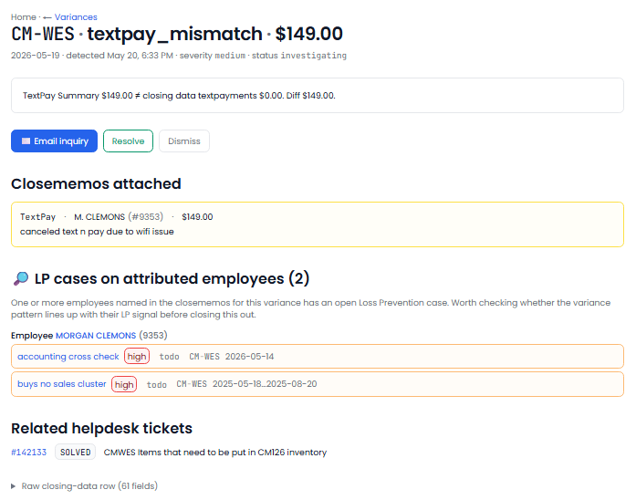
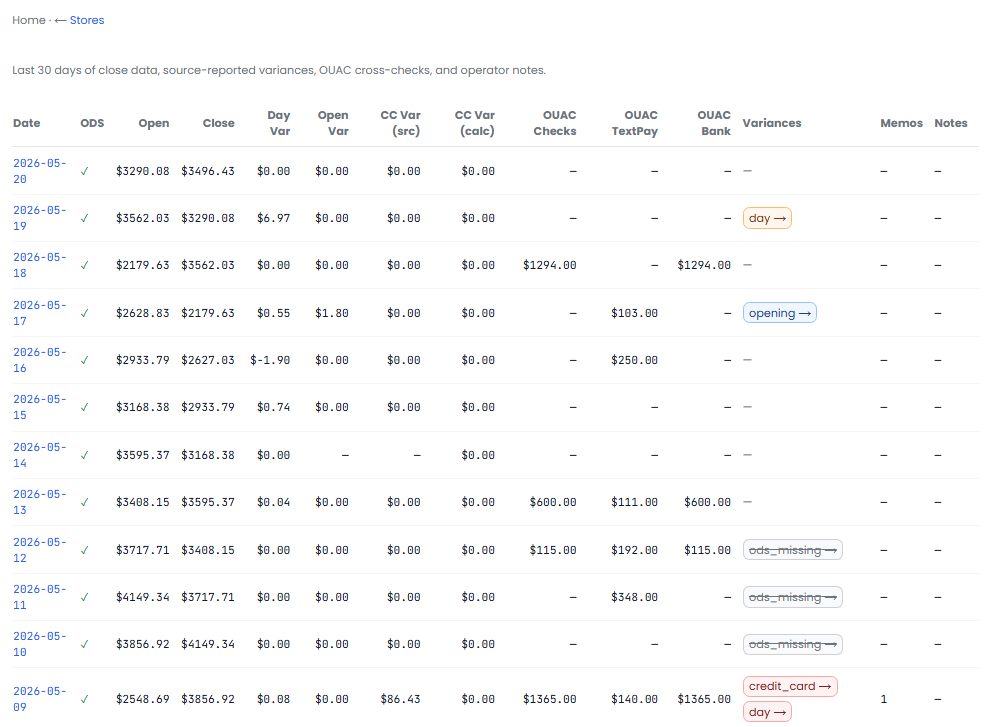
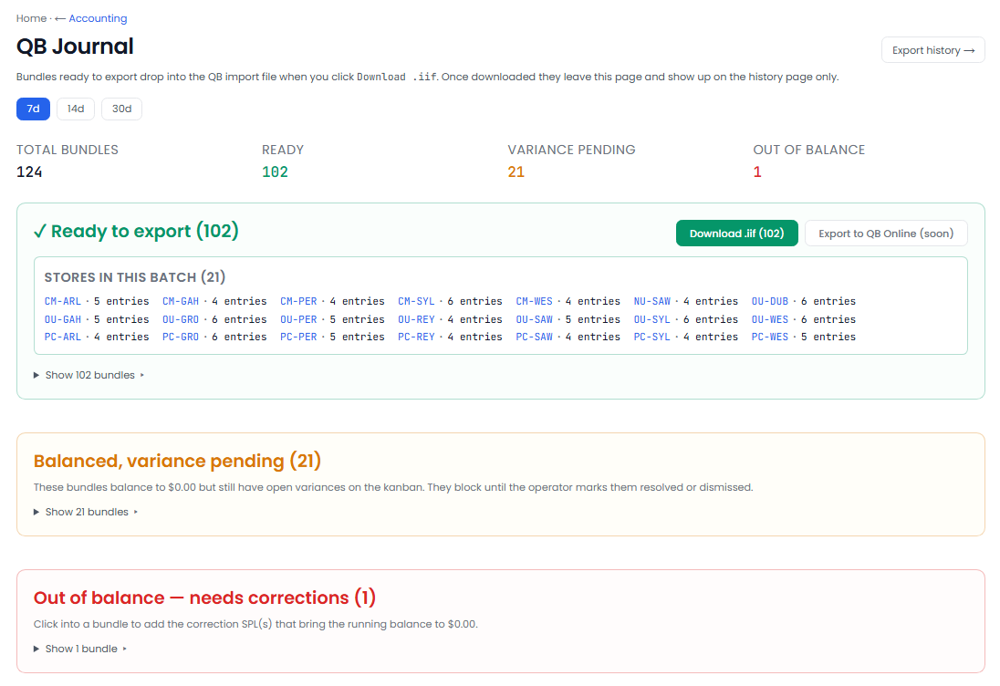
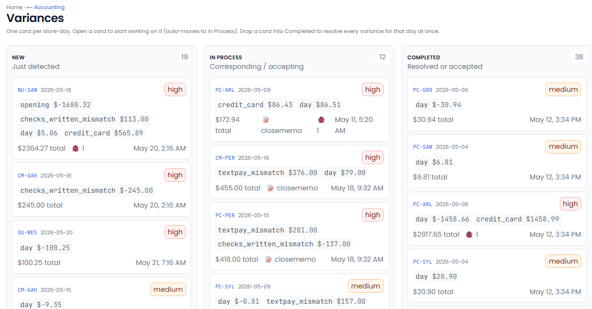

[← Back to overview](README.md)

# Accounting Boss

**Daily reconciliation, done before you're awake.**

> _Replaces / augments: Accounting manager + reconciliation clerk_

Closing the books and reconciling daily numbers is exacting, repetitive work — and the kind where small errors hide for weeks. Accounting Boss takes in your daily financial reports the moment they arrive, checks them against what *normal* looks like for each location, routes each problem to the right person, and keeps the chain between your point-of-sale, your bank, and QuickBooks unbroken.

---

## Everything it does

### Takes in the day's numbers automatically
- Ingests your **daily financial reports** the moment they land — store sales summaries, check-out summaries, text/SMS payments, bank activity, and pre-flagged variances.
- Pulls in **QuickBooks exports** as they arrive.
- Re-processing the same file is always safe — no duplicates, ever.

### Knows what "normal" looks like — per store
- Learns each location's **own typical range**, so a flag means genuinely unusual for *that* store, not just different from the chain.
- Tightens its tolerances automatically as it learns each store, instead of using one blunt threshold everywhere.

### Catches the things that cost you money
Six independent checks run against every store, every day:
- **Missing daily report** — a store never closed out or never sent its numbers.
- **Cash over / short** — the drawer doesn't reconcile within that store's tolerance.
- **Unusual day-over-day swing** — sales moved more than normal for that store and day of week.
- **Missing close-out notes** — a sales day with no closing memo.
- **Employee-specific patterns** — a recurring variance tied to one person's shifts.
- **Bank deposit mismatch** — the deposit on record doesn't match the bank.

Each issue is captured with its severity, the dollar amount, and the supporting detail.

### Routes every issue to the right person
- **Automatically routes** each variance by type, store, and severity to the right owner — cash variance to the store manager, banking issue to the bookkeeper, and so on.
- Opens a **conversation thread** per issue, with the outreach email pre-drafted. Replies land back in the thread.
- Each issue can be **confirmed, dismissed (with a reason), or re-routed.**

### Spots chronic, recurring problems
Beyond single-day issues, it watches for store-level patterns:
- **Recurring variances** — the same issue at the same store 3+ times in a month.
- **Close-out droughts** — 5+ straight days with no closing notes.
- **Repeated employee corrections** — the same person correcting the same thing again and again.

Patterns clear themselves once the underlying issue stops.

### Keeps QuickBooks honest
- Validates that **every day in your books has a matching QuickBooks entry**, and every entry reconciles against the bank.
- Flags **unmatched entries** in either direction and **stale books** (no export in several business days), with a one-click reconcile action.

### Sends a weekly digest
- A **Monday-morning summary**: what was opened last week, what was resolved and how, your top stores by open dollars, active patterns, and the health of your QuickBooks reconciliation.

---

## What you'll see

> _Screenshot: `/accounting` home — headline tiles, open variances grouped by store, and reconciliation health._

> _Screenshot: a single variance — the evidence, who it was routed to, and the conversation thread with the pre-drafted email._

> _Screenshot: a store's last 30 days — sales, drawer, deposits, close-out notes, and any variances or patterns inline._

> _Screenshot: the QuickBooks reconciliation view — unmatched entries and stale-book alerts with one-click reconcile._

> _Screenshot: the weekly digest — opened, resolved, top stores by open dollars, and reconciliation health._

---

## Decisions it puts in front of you

- "Store 14 was $120 short today — and it's the third short in two weeks. Here's the drafted note to the manager."
- "Yesterday's deposit doesn't match the bank by $340. Here's the detail."
- "These books haven't been updated in 6 days."
- "This store has gone 5 days without close-out notes."

---
[← Helpdesk Boss](helpdesk-boss.md) · [Back to overview](README.md) · [Next: HR Boss →](hr-boss.md)
