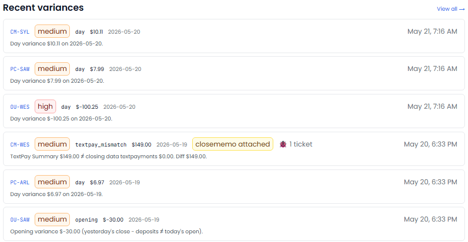

[← Back to overview](README.md)

# Accounting Boss

**Daily reconciliation, done before you're awake.**

> _Replaces / augments: Accounting manager + reconciliation clerk_

Closing the books and reconciling daily numbers is exacting, repetitive work — and the kind where small errors hide for weeks. Accounting Boss takes in your daily financial reports the moment they arrive and checks them against what *normal* looks like for each location, flagging anything out of place within minutes.

## What it does for you

- **Reconciles automatically, fast.** As soon as the day's reports land, Accounting Boss reviews them and surfaces problems within minutes — not at month-end.
- **Knows what "normal" is for each location.** It learns each store's typical range, so a flag means *genuinely* unusual, not just "different from the chain average."
- **Catches the things that cost you money:**
  - Cash drawers over or short
  - Missing daily sales reports
  - Unusual day-over-day swings
  - Missing close-out notes
  - Bank deposit mismatches
  - Patterns tied to a specific employee
- **Keeps QuickBooks honest.** Validates that your books match the underlying activity, tracks anything that didn't reconcile, and alerts you when the books have gone stale.
- **Spots chronic issues.** A variance that keeps recurring at the same location gets escalated, not re-flagged forever.

## What you'll see

> _Screenshot: Accounting Boss — the day's variances, ranked by severity, each with the store and the reason._

## Decisions it puts in front of you

- "Store 14 was $120 short today — and it's the third short in two weeks. Worth a look."
- "Yesterday's deposit doesn't match the bank. Here's the difference."
- "These books haven't been updated in 6 days."

---
[← Helpdesk Boss](helpdesk-boss.md) · [Back to overview](README.md) · [Next: HR Boss →](hr-boss.md)
