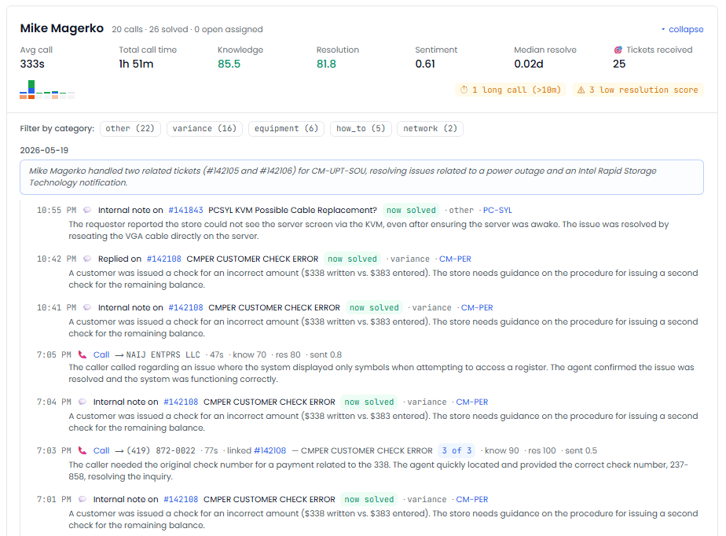
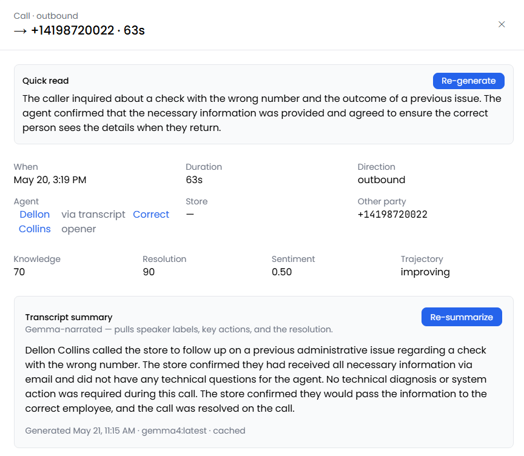
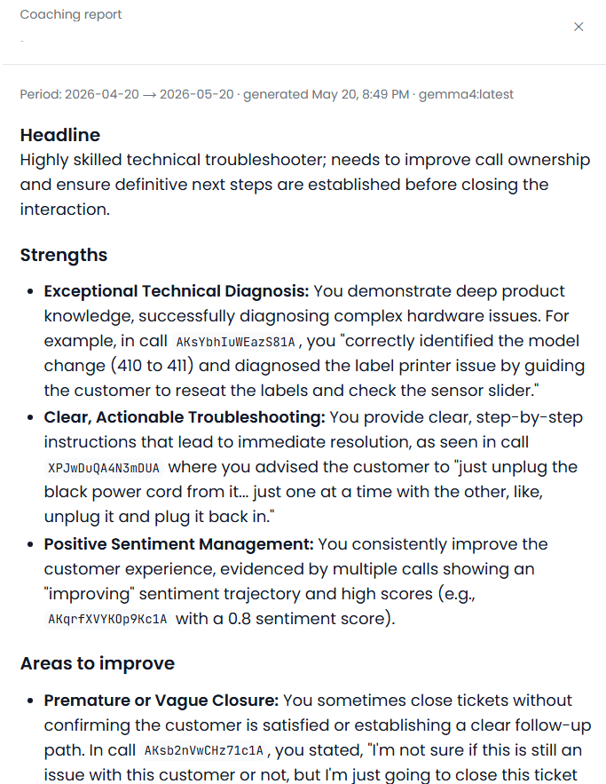
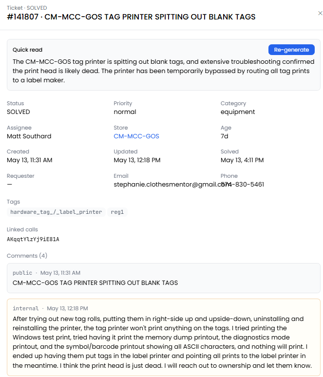
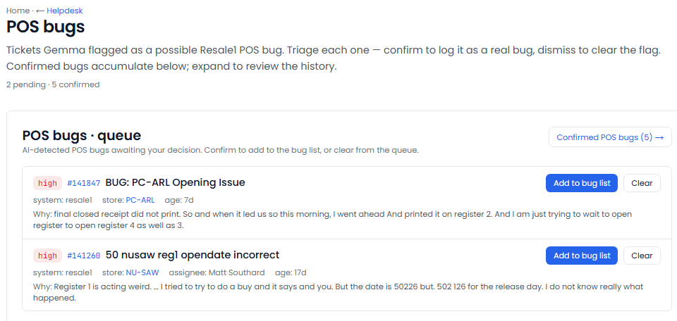
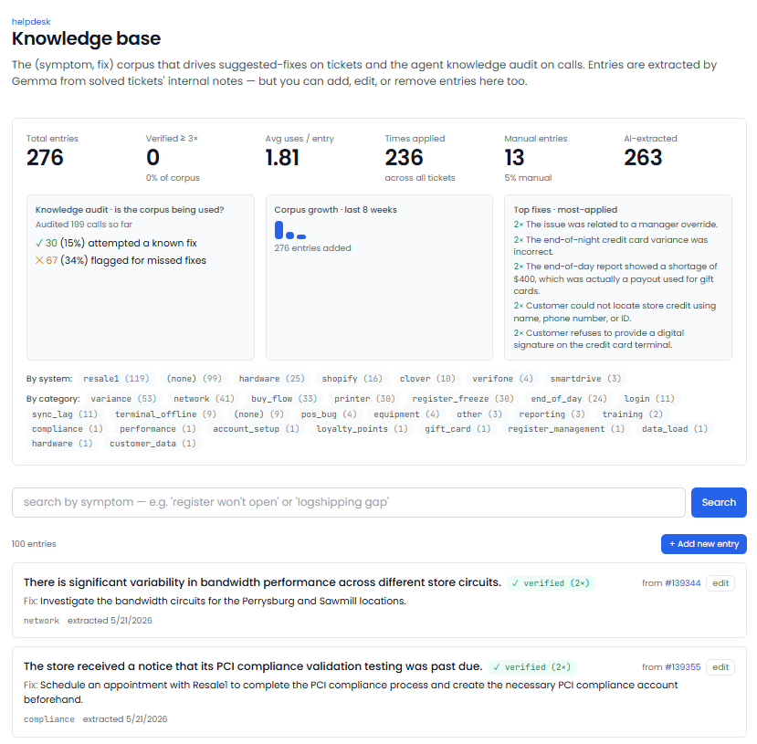

[← Back to overview](README.md)

# Helpdesk Boss

**Your helpdesk manager and agent coach — on duty 24/7.**

> _Replaces / augments: Helpdesk manager + agent coach_

A busy support operation generates more signal than any manager can read: every ticket and every call says something about how well the issue was solved, how the customer felt, and whether the same problem keeps coming back. Helpdesk Boss reads **all** of it — every ticket and every call — scores it, coaches your team, and quietly builds the knowledge base that turns repeat problems into one-click fixes.

---

## Everything it does

### Reads and scores every interaction
- Takes in **every support ticket and every phone call** automatically, around the clock.
- Scores each call on **three independent measures**: how knowledgeable the agent was, whether the call actually resolved the issue, and the customer's sentiment.
- Tracks a **sentiment trajectory** for each call — improving, flat, or going downhill.
- Backs **every score with a direct quote** from the conversation. If it can't cite evidence, it won't guess.
- **Flags the calls that need review** automatically — strongly negative customer sentiment, or long calls that resolved nothing.

### Coaches your agents
- Produces a **coaching report for every agent**, refreshed daily: a one-line headline, specific strengths (with quotes), areas to improve, a suggested focus for the week, and the numbers at a glance.
- **Learns your read on each agent** — notes you keep tune the tone and emphasis of their coaching.
- When you review a flagged call and decide the agent fell short, that decision is **folded into their next coaching report** automatically.
- Maintains a **per-agent timeline** — every call and ticket interleaved, with scores and aggregate stats.

### Catches problems before they spread
- **Persistent-issue detection:** when the same problem hits the same location more than once in 24 hours, it opens an alert and **drafts the outreach email** to that store — ready for you to send or edit.
- **Software-bug triage:** decides whether a ticket is a genuine software defect or a training issue, assigns a severity and the affected system, and lets you confirm or dismiss.
- **Stale & untouched tickets:** surfaces tickets with no response past your threshold, and anything aging past 90 days.

### Builds institutional knowledge automatically
- Turns **solved tickets into reusable fixes** — a searchable library of "this symptom → this proven fix."
- You mark **"this fix worked"** to verify a fix; verified fixes are the only ones it recommends.
- On every new ticket, it suggests the **top matching proven fixes** with one-click apply — so the next person doesn't reinvent the solution.
- Runs a **knowledge audit**: did the agent use the known fix, or freelance? Missed known fixes are flagged on the call.

### Keeps an eye on the whole operation
- **Daily store health-check monitoring** — tracks the daily check-in reports and flags any store missing its data today.
- **Trouble-trend views** over 7, 30, and 90 days.
- **Stores ranked by open ticket volume**, with last-activity timestamps.

---

## What you'll see

> _Screenshot: `/helpdesk` home — headline tiles, the "Needs review" queue, persistent-issue alerts, and per-agent timeline._

> _Screenshot: a single call — the three scores, the supporting quotes, the conversation summary, and any missed-fix findings._

> _Screenshot: an agent's coaching report — strengths, areas to improve, and a focus for the week, all backed by real examples._

> _Screenshot: a ticket with its top suggested proven fixes and one-click "apply this fix."_

> _Screenshot: the software-bug board — confirmed defects separated from training issues, by severity._

> _Screenshot: the self-building knowledge base — searchable fixes with how many times each has been confirmed._

---

## Decisions it puts in front of you

- "This location reported the same problem 3 times today — here's a drafted heads-up, ready to send."
- "This call scored low on resolution. Here's the exact moment that shows why."
- "This agent missed a known fix on two calls this week — it's in their coaching report."
- "This answer keeps working — approve it for the knowledge base?"

---
[← Back to overview](README.md) · [Next: Accounting Boss →](accounting-boss.md)
