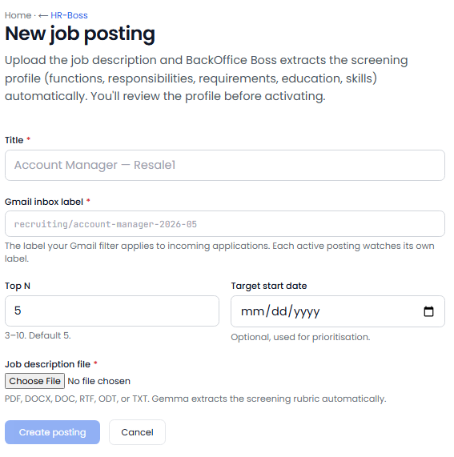
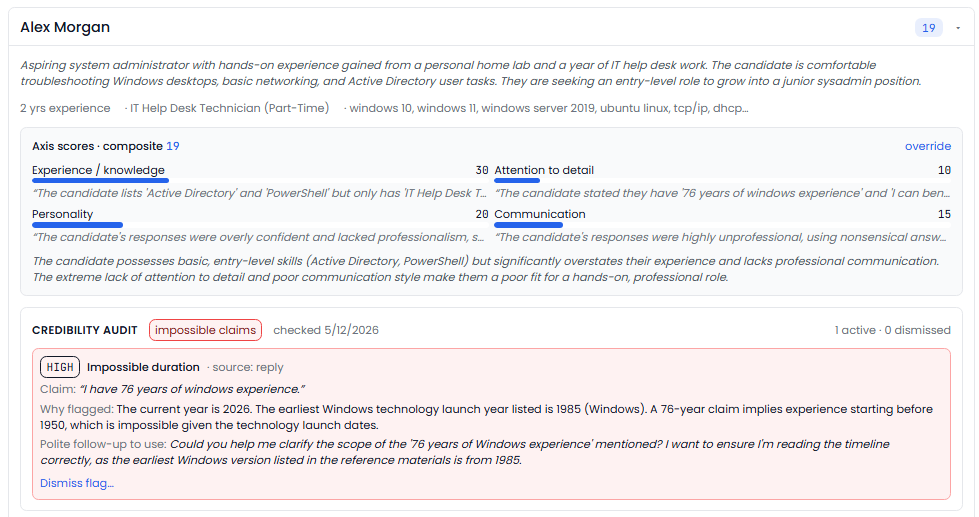
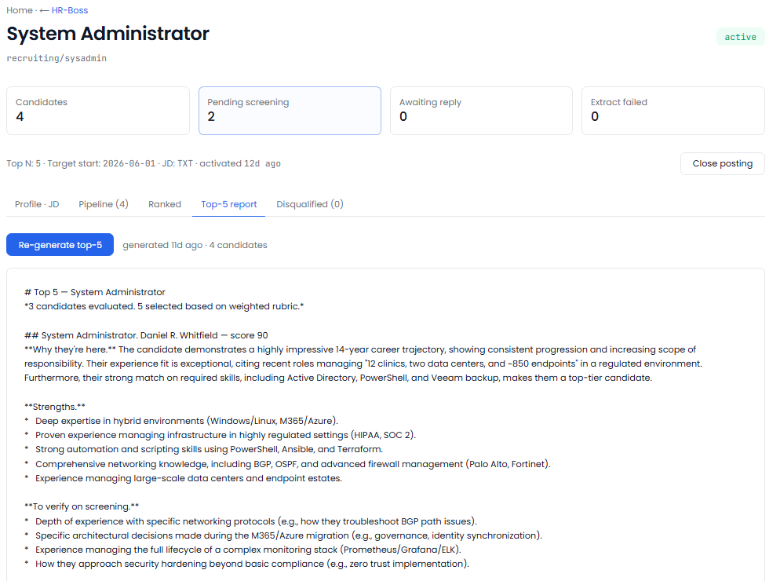

[← Back to overview](README.md)

# HR Boss

**Every resume reviewed the moment it arrives.**

> _Replaces / augments: Recruiter + screening lead_

Good candidates lose interest fast when no one gets back to them. HR Boss reads every resume the instant it lands, figures out which job it's for, scores how well the person fits, and drafts a warm, genuinely human reply — so your best applicants hear from you first, and never feel like they got a form letter.

---

## Everything it does

### Reads and routes every applicant
- Reviews **every resume the moment it arrives** — no application sits unread for days.
- **Routes each resume to the right opening** automatically. Anything it can't place lands in an intake list for you to assign in one click.
- Pulls a **structured profile** out of each resume: experience, education, skills, certifications, location, and years in the field.

### Scores fit — and shows its work
- Scores each candidate **0–100 against the specific role** they applied for.
- Breaks the score down across **experience, skills, location, and education**, with a short written rationale — so you see *why*, not just a number.
- **Re-scores automatically** when you refine a role's requirements.

### Drafts outreach that sounds like you — never like a bot
- Drafts the **next outreach email** for each candidate, in your voice.
- A built-in **"never sound like AI" check** rejects telltale phrasing, canned openers, and robotic tone before a draft ever reaches you.
- Handles the **back-and-forth**: when a candidate replies, it understands the reply (interested, scheduling, a question, a decline) and drafts your next message.
- **Nothing is ever sent without your approval** — every email is yours to review, edit, or rewrite.

### Learns your taste over time
- When you **override a score**, it remembers. Your corrections are distilled into a per-role rubric so future candidates are judged the way *you* judge them.
- Each role's "ideal candidate" profile and rubric are **yours to hand-edit** any time.

### Keeps your pipeline moving
- Maintains a **ranked short-list** per role.
- Flags **dormant postings** — open roles that haven't seen a new applicant in two weeks — so you can decide whether to close them.
- Tracks every candidate's **status**: screening, advanced, declined, hired, deferred.

---

## Fairness & EEOC bias compliance

A system that scores and ranks job applicants has to be **demonstrably fair** — and able to prove it. Fairness isn't a footnote in HR Boss; it's a gate the scoring has to pass before it's ever used on a real candidate.

- **Demographic-neutral by design.** The scoring looks at experience, skills, location, and education — the things that actually predict fit. It is explicitly built and tested *not* to let a candidate's name or implied demographic move the score.
- **Tested with paired profiles.** A curated test set contains pairs of identical résumés that differ only in the candidate's name (and the demographic it implies). The two must score within a **tight tolerance of each other** — if they ever diverge, that's a failure.
- **Checked before every change.** Any change to the system is automatically run against that fairness test set first. If scoring isn't consistent across the paired profiles, the change does not ship. Full stop.
- **Re-checked on a schedule.** Beyond pre-change testing, the live system is **re-audited on a recurring basis** against the same fairness set, and you're alerted immediately if scoring ever drifts out of tolerance.
- **Auditable end to end.** Every score carries its reasoning and its inputs, and every human override is recorded — so hiring decisions can be explained and reviewed after the fact.
- **A human always decides.** The score is a screening aid, never an automated hiring or rejection. No outreach, advancement, or decline is sent without your explicit approval.

> This is aligned with the spirit of **EEOC** guidance on automated employment-decision tools: keep the criteria job-related, test continuously for adverse impact across demographic groups, keep a human in the loop, and keep records. _(BackOfficeBoss provides the tooling and audit trail; it is not legal advice — your counsel should confirm your specific obligations, including any state or local rules such as automated-employment-decision-tool laws.)_

---

## What you'll see

> _Screenshot: `/hr` home — open roles, pipeline counts, new applicants this week, and intake awaiting routing._

> _Screenshot: a single role — every candidate ranked by fit score, with status and last contact._

> _Screenshot: a candidate — the structured profile, the fit-score breakdown with reasoning, the resume, and the drafted reply ready to send._

> _Screenshot: the intake list — unrouted resumes you assign to a role in one click._

> _Screenshot: the fairness check — the most recent bias-test run, its pass status, and the score spread across paired profiles._

---

## Decisions it puts in front of you

- "Strong match for the Store Manager role — experience and location both check out. The reply is drafted."
- "This applicant scores higher for a different opening you have."
- "Three promising candidates applied today; here they are, ranked, with replies ready."
- "This role hasn't had an applicant in 14 days — close it?"

---
[← Accounting Boss](accounting-boss.md) · [Back to overview](README.md) · [Next: Loss Prevention Boss →](loss-prevention-boss.md)
