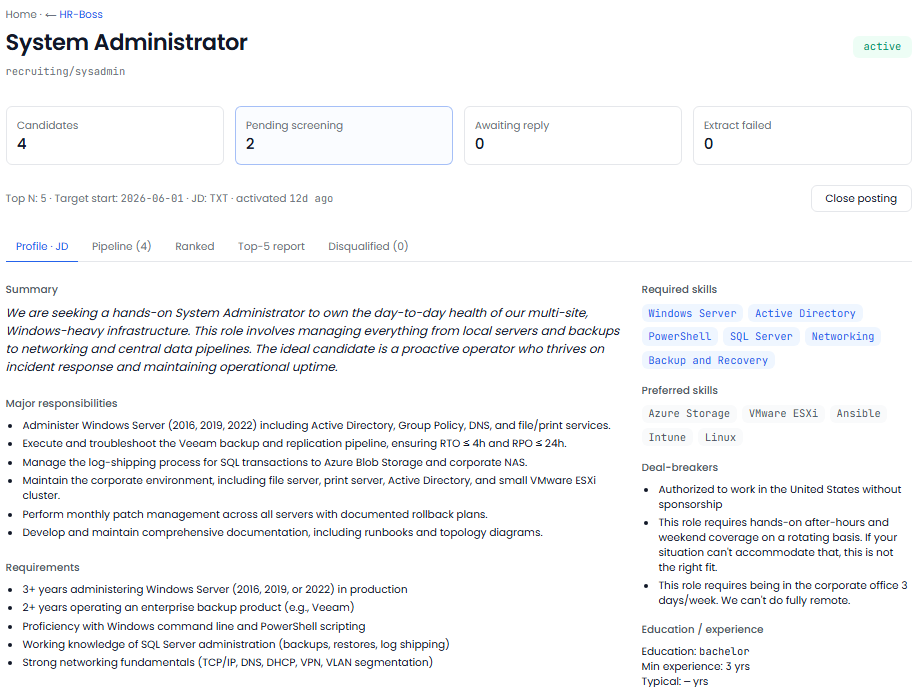

[← Back to overview](README.md)

# HR Boss

**Every resume reviewed the moment it arrives.**

> _Replaces / augments: Recruiter + screening lead_

Good candidates lose interest fast when no one gets back to them. HR Boss reads every resume the instant it lands, scores how well the person fits the role, and drafts a warm, human-sounding reply — so your best applicants hear from you first.

## What it does for you

- **Reviews every applicant instantly.** No resume sits in an inbox for days. Each one is read, summarized, and scored against the specific job you're hiring for.
- **Scores fit across what matters.** Experience, skills, location, and education are each weighed — so you see *why* someone is a strong or weak match, not just a number.
- **Drafts the outreach for you.** A personalized, on-brand message is ready to send with one click.
- **Learns your taste.** As you adjust and override its picks, HR Boss adapts its scoring to match what *you* actually look for in a hire.
- **Built to be fair.** A regular, automatic check makes sure scoring stays consistent and unbiased across applicants.

## What you'll see

> _Screenshot: HR Boss — ranked candidates for an open role, each with a fit breakdown and a drafted reply._

## Decisions it puts in front of you

- "Strong match for the Store Manager role — experience and location both check out. Reply is drafted."
- "This applicant is a better fit for a different opening you have."
- "Three promising candidates applied today; here they are, ranked."

---
[← Accounting Boss](accounting-boss.md) · [Back to overview](README.md) · [Next: Loss Prevention Boss →](loss-prevention-boss.md)
