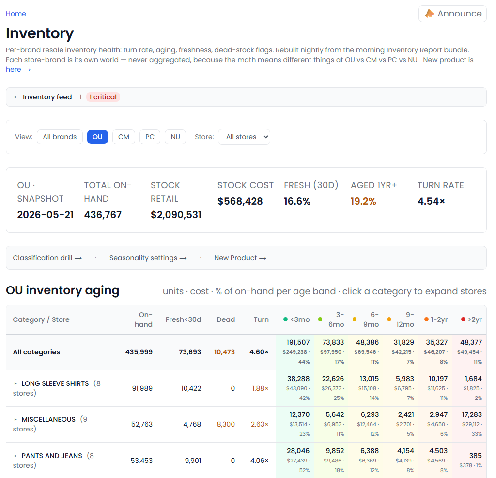
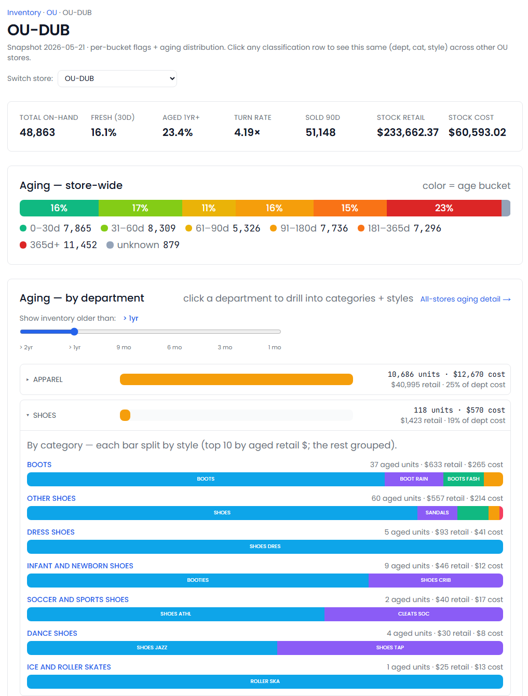
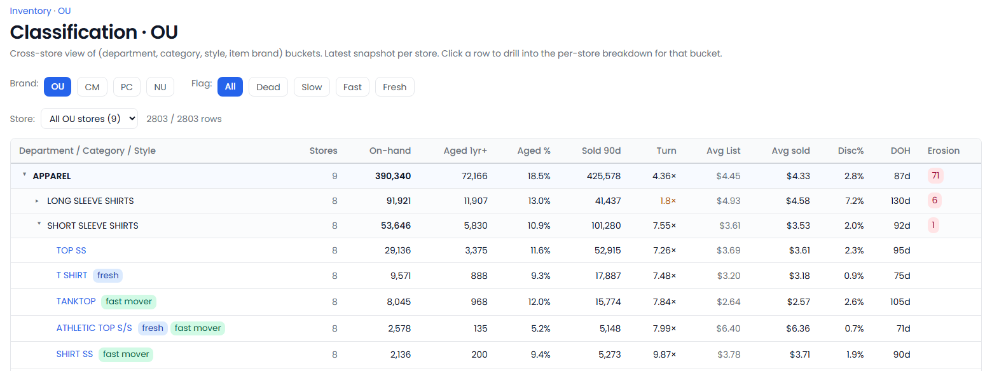
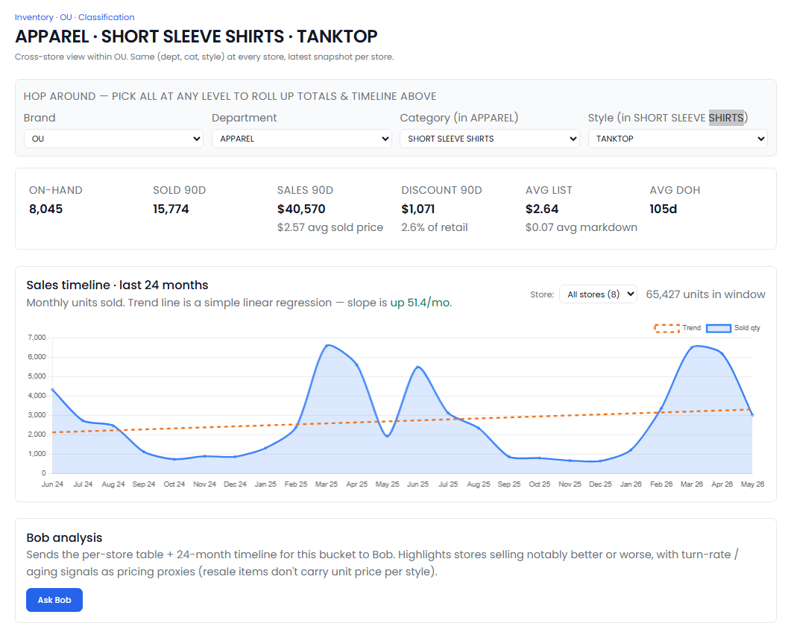
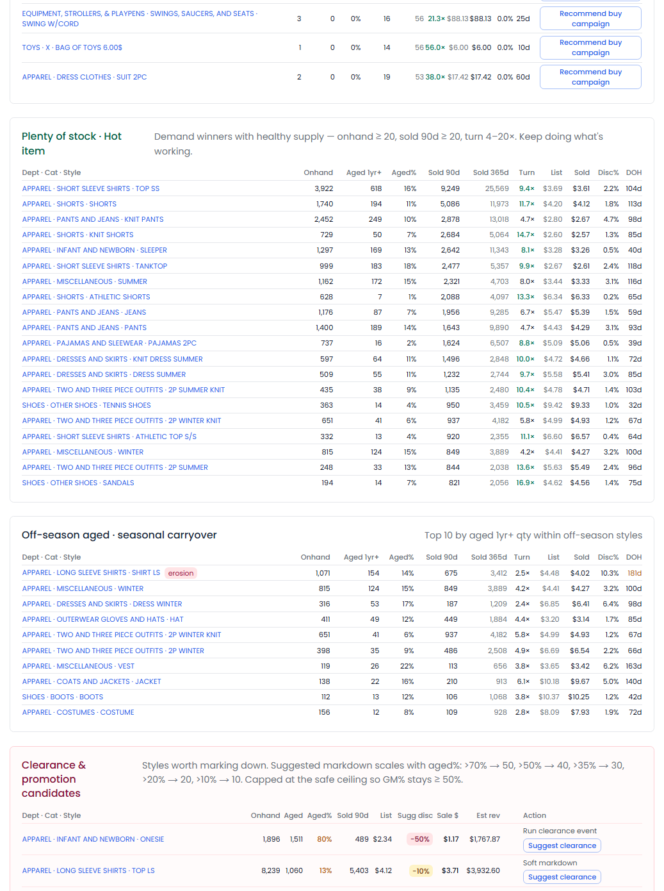
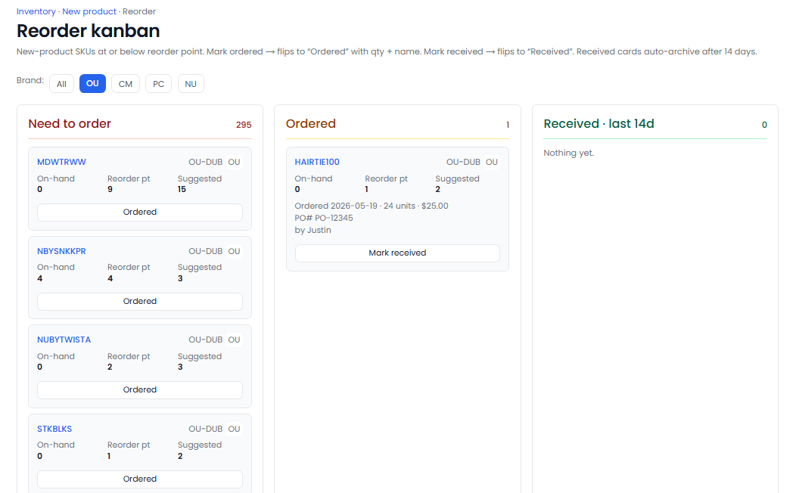
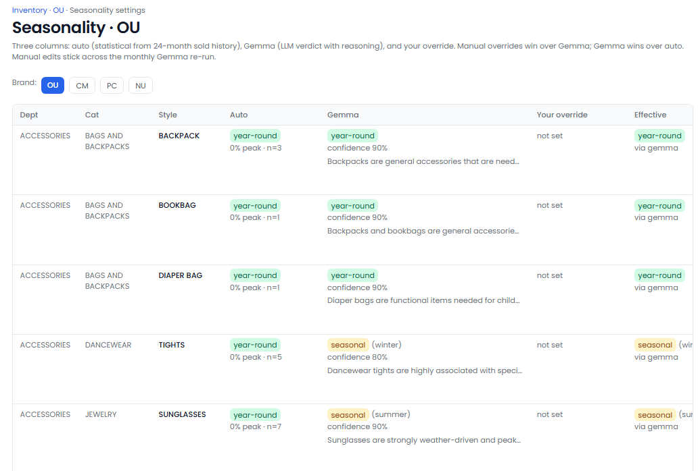

[← Back to overview](README.md)

# Inventory Boss

**Know what's selling, what's sitting, and what to do about it.**

> _Replaces / augments: Inventory manager + merchandiser + buyer_

Inventory Boss keeps your sales floor moving. Every morning it reads your inventory and tells you — for each store and each kind of merchandise — what's selling, what's aging into clearance territory, what's running low and needs reordering, and what to mark down or source more of. It works **brand by brand**, so the signal from one concept never muddies another, and it turns raw stock counts into clear actions.

---

## Everything it does

### Aging & dead stock
- Buckets every item by **how long it's been on the floor** (under 30 days, 1–3 / 3–6 / 6–9 / 9–12 months, 1–2 years, 2+ years) so you can see a store's staleness at a glance.
- A **"freshness" reading** — the share of stock brought in within the last 30 days (the new finds that bring shoppers back) — alongside what's aged six months and a year-plus.
- **Flags dead stock** (on the floor a year with zero sales) and **slow movers** per store and per merchandise type.
- An **interactive aging explorer** — slide to "show me everything older than 6 months / 1 year / 2 years" and drill from department to category to style, with units, retail value, and cost at each level.
- Items with **no known purchase date** are kept in a separate bucket so they never falsely inflate your aged numbers.

### Classification & cross-store analysis
- A **cross-store view** of every department, category, style, and item-brand, with on-hand, aged %, recent sales, and turn rate — expandable down to a single style.
- A **per-style page** showing how the same item performs at *every* store, plus a **24-month sales chart** with an automatic rising / flat / falling trend line.
- **One-click AI analysis** of any style that writes up which stores are doing notably better or worse, and why.
- Surfaces **hot items two ways**: selling fast with little left (source more) and strong demand with healthy stock (keep it up).

### Pricing, discounting & margin
- Tracks **average ticket price vs. average actual sold price**, and the resulting discount %.
- Tracks **average days on hand** before an item sells.
- Flags **margin erosion** — items that both sit a long time *and* sell at deep discounts.
- Distinguishes genuine **clearance of old stock** from sale-driven volume on fresh inventory.

### Clearance & markdown recommendations
- A **clearance candidate list** that recommends a markdown depth scaled to how aged the stock is, suggests a sale price and estimated recovery, and is **capped to protect your margin.**

### Retail value & cost
- Every view reports the **actual retail dollar value and cost** of stock on hand — store-wide, by department, and by style — not just unit counts.
- Day-to-day stock value can be watched so you spot swings early.

### Seasonality (so off-season items aren't wrongly flagged)
- **Learns which items are genuinely seasonal** (coats, swimwear) from sales history, so a coat aging in summer doesn't trigger a false clearance flag.
- An **AI pass refines** the call, separating truly weather/calendar-driven items from year-round items with seasonal noise — with its reasoning shown.
- A **settings screen shows three columns side by side** — the data's verdict, the AI's verdict, and **your override** — and your decisions stick. Set per brand, because climate and demographics differ by region.

### Store-level inventory
- A **per-store page** with headline tiles (on-hand units, freshness, aged %, turn rate, recent sales, retail value and cost), an aging breakdown, aging by department, and ranked lists of dead stock, slow movers, hot items, and off-season carryover.

### New-product tracking & reordering
- Tracks the **add-on / impulse products** sold at the register and answers: is each one **lifting basket size**, is it profitable, which should be swapped out, and which need reordering.
- Each item gets a **verdict** — basket-lifter, profitable on its own, weak link, or dead — with a plain-language explanation.
- A **reorder board** (Need to order → Ordered → Received) flags items at or below their reorder point; you log quantity, cost, order date, PO number, and who ordered. Received cards auto-archive.
- **Reorder points recalculate automatically** from sales velocity, with an editor to override them per store or item for bulk buys, long lead times, or seasonal pre-stocking.

### Hands work off to Marketing
- From any store you can hand a **clearance markdown** or a **"buy campaign"** (drive to acquire more of a hot, short-stocked item) straight to [Marketing Boss](marketing-boss.md) as a suggested promotion — and see its status without leaving Inventory.

---

## What you'll see

> _Screenshot: `/inventory` home — the brand picker, side-by-side brand cards, summary tiles, the aging grid, and ranked stores._

> _Screenshot: the aging explorer — department / category / style aging with units, retail value, and cost._

> _Screenshot: the cross-store classification table, with flag filters for dead, slow, and hot stock._

> _Screenshot: a single style — per-store performance, the 24-month sales chart, and the one-click AI analysis._

> _Screenshot: a store's inventory — tiles, aging breakdown, and ranked dead / slow / hot / off-season lists._

> _Screenshot: the new-product reorder board — items below their reorder point moving through Need to order → Ordered → Received._

> _Screenshot: the seasonality settings — the data's verdict, the AI's verdict, and your override, side by side._

---

## Decisions it puts in front of you

- "This store is carrying $14,000 of stock that's sat over a year — here are clearance markdowns capped to protect margin."
- "This style sells in three days at Store 4 but sits 90 days at Store 9 — here's the analysis."
- "These three register add-ons are below reorder point — here's the reorder card."
- "This item is hot and nearly out — want to launch a buy campaign to source more?"

---
[← Marketing Boss](marketing-boss.md) · [Back to overview](README.md) · [Read the FAQ →](FAQ.md)
