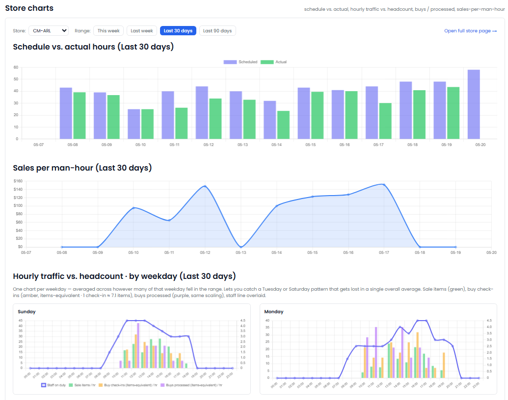

[← Back to overview](README.md)

# Labor Planner

**The right people, at the right time, in every store.**

> _Replaces / augments: Labor planner + schedule analyst_

Labor is one of your biggest controllable costs — and one of the easiest to get wrong. Overstaff and you bleed margin; understaff and you lose sales. The Labor Planner matches your staffing to actual demand, store by store and hour by hour.

## What it does for you

- **Connects schedules, time clocks, and foot traffic.** It brings together who was *scheduled*, who was *actually there*, and when customers actually showed up.
- **Measures productivity fairly.** Sales generated per labor hour is compared against peer stores, so you see who's truly efficient.
- **Flags the costly mismatches:**
  - **Understaffed** — busy, but not enough people to capture the sales
  - **Overstaffed** — paying for hours that aren't producing
  - **Schedule drift** — when actual hours stray too far from the plan
- **Finds the real peaks.** It identifies each store's true busy hours so schedules match reality, not habit.
- **Surfaces attendance and scheduling gaps.** When the roster on paper doesn't match what happened, you'll know.

## What you'll see

> _Screenshot: the Labor Planner — an hourly view of traffic versus staffing, with over/under-staffing flags._

## Decisions it puts in front of you

- "Store 9 is consistently understaffed at its Saturday lunch peak — you're likely leaving sales on the table."
- "This location's scheduled hours and actual hours are drifting apart."
- "Sales per labor hour here is well below its peers — worth a closer look."

---
[← Data Analyst](data-analyst.md) · [Back to overview](README.md) · [Read the FAQ →](FAQ.md)
