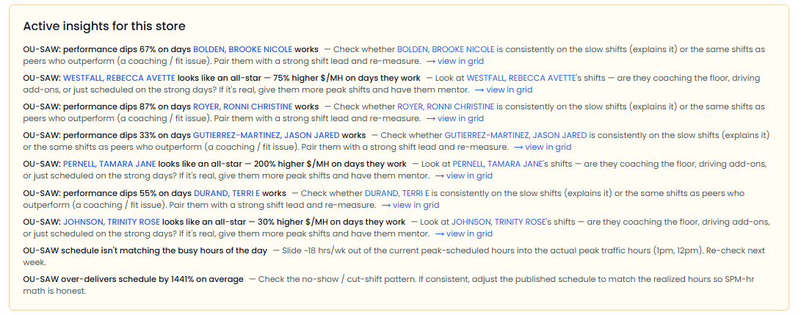
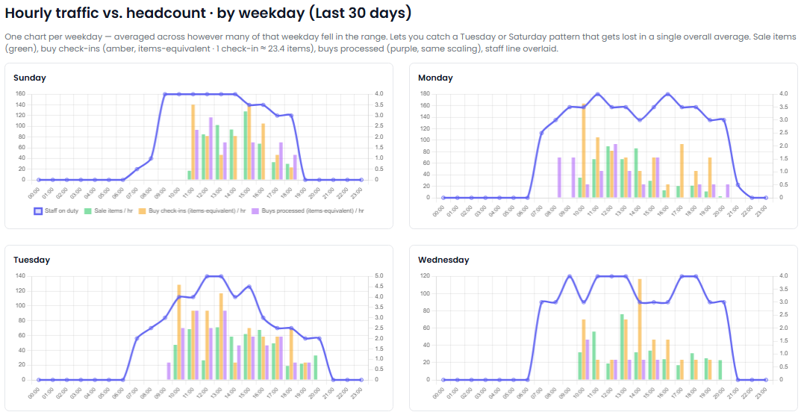

[← Back to overview](README.md)

# Labor Planner

**The right people, at the right time, in every store.**

> _Replaces / augments: Labor planner + schedule analyst_

Labor is one of your biggest controllable costs — and one of the easiest to get wrong. Overstaff and you bleed margin; understaff and you lose sales. The data to fix it usually exists, but in separate reports that never get joined. The Labor Planner does the join — matching who you scheduled, who actually showed up, and when customers actually came in.

---

## Everything it does

### Joins the three things no one connects
- Brings together **scheduled shifts, actual time-clock punches, and hour-by-hour customer traffic** — for every store, every day.
- Handles the messy reality automatically: matching names to people, ignoring corporate/non-store codes, and counting buy **drop-offs correctly** (one customer dropping off many items is one visit, scaled to a fair comparison).

### Measures productivity the right way
- Computes **dollar sales per labor hour** for each store, using **only confirmed clocked hours** — the truest version of the number.
- Compares each store against **its own brand's peers**, not the whole company.
- Tracks **scheduled vs. actual hours**, headcount, and the minimum number of people on the floor.

### Flags the costly mismatches
- **Understaffed** — the team is productive but sales are short of peers: you likely need more hands.
- **Overstaffed** — low productivity and short sales: cut hours or drive more sales.
- **Schedule drift** — actual hours straying more than 15% from the plan, meaning the schedule is unrealistic or attendance is unreliable.

### Shows you exactly when to staff
- The signature view: an **hour-by-hour chart** overlaying customer traffic against staff on duty.
- It tells the story at a glance — *"you have 7 people at 9 AM when the floor is empty, and only 3 at 1 PM when traffic peaks."*
- Identifies each store's **true peak hours** for both sales and buys, so schedules match reality instead of habit.

### Makes it scannable
- A **store-by-day grid**, color-toned so healthy and concerning stores jump out.
- A **brand comparison** putting sibling stores side by side on hours, sales, and productivity.
- A **per-store drilldown** with 30-day trends and a daily detail table.

---

## What you'll see

> _Screenshot: `/labor` home — headline tiles, the labor insights list, and the color-toned store-by-day grid._

> _Screenshot: a store's drilldown — scheduled-vs-actual hours, the productivity trend, and the daily detail table._

> _Screenshot: **the** chart — hour-by-hour customer traffic overlaid with staff on duty, showing exactly where staffing misses demand._

---

## Decisions it puts in front of you

- "Store 9 is consistently understaffed at its Saturday lunch peak — you're leaving sales on the table."
- "This location's scheduled and actual hours are drifting apart by 20%."
- "This store's sales per labor hour is well below its peers — overstaffed, or scheduled at the wrong times."

---
[← Data Analyst](data-analyst.md) · [Back to overview](README.md) · [Next: Marketing Boss →](marketing-boss.md)
