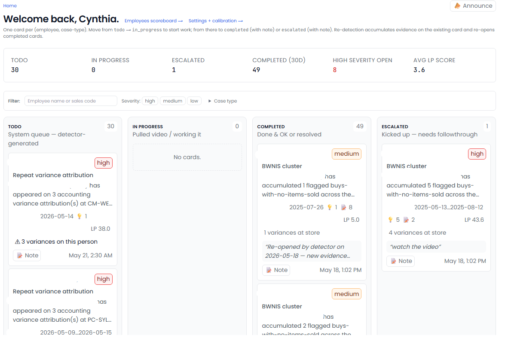
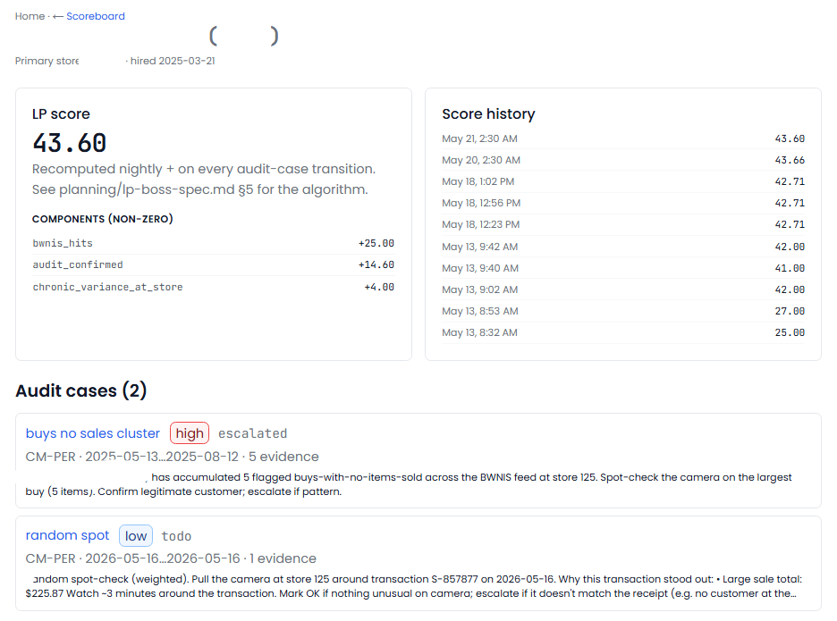
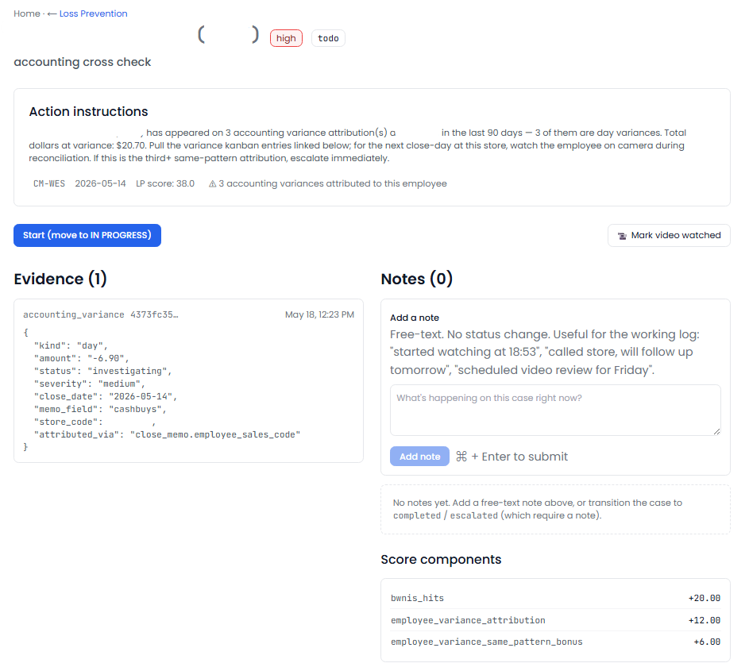

[← Back to overview](README.md)

# Loss Prevention Boss

**A tireless investigator watching every transaction.**

> _Replaces / augments: Loss-prevention investigator_

Shrink and internal theft hide in the noise of thousands of routine transactions. Loss Prevention Boss reviews them all, scores every salesperson's risk against their peers, runs live checks for the specific patterns that signal a problem, and makes sure even clean-looking employees get audited — so the cases on your desk are the ones worth your time.

---

## Everything it does

### Scores every salesperson's risk — fairly
- Gives every active salesperson a **risk score**, recomputed nightly.
- Scores are **relative to peers at the same store**, so a generous-discount brand doesn't make everyone look guilty.
- Weighs the signals that matter: **discount rate, return rate, voids, no-sale drawer opens, suspicious buy patterns, and cash-variance contribution.**
- Outliers are dampened so a single odd day doesn't distort the score.

### Runs live fraud detectors
- **Buys with no items sold** — the classic red flag where cash goes out but no merchandise comes in. It clusters these by employee and flags anyone well above their peers.
- **Large cash buys without ID verification** — cash buys over a threshold with no ID on file.
- **Accounting cross-check** — when a store's cash variance lines up with one specific person's shifts, it opens a loss-prevention case (separate from the bookkeeping side).

### Audits everyone — unpredictably
- Picks **weighted random spot-checks** every night, so investigations can't be gamed by only chasing the obvious suspects.
- Newer employees and those not checked recently get **extra weight.**
- A **hard floor guarantees every employee is reviewed at least once a quarter**, no exceptions.

### Organizes the work
- Every finding becomes a **case on a simple board**: to-do → in progress → escalated → resolved.
- Each case carries its **evidence** — the specific transactions, dates, amounts, and how the person compares to peers — so you investigate with the facts in hand.
- Resolve a case with a finding (training, theft, system issue, or no issue), escalate it, re-route it to accounting, or dismiss it with a reason.

### Tunable to your business
- **Detector thresholds, score weights, and audit frequency** are all adjustable to fit your operation's risk tolerance.

---

## Fairness & bias compliance

A risk score decides **who gets investigated** — so it carries the same fairness obligations as a hiring decision, and Loss Prevention Boss holds it to the same standard as [HR Boss](hr-boss.md).

- **Driven by behavior, not identity.** The score is built from transaction behavior measured against peers — discounts, returns, voids, no-sales, suspicious buys, cash variance. It is explicitly designed *not* to be influenced by a person's name or demographic.
- **Tested for demographic neutrality.** The scoring is run against a fairness test set, and scores for otherwise-identical profiles must stay within a **tight tolerance** regardless of demographic. Divergence is treated as a failure.
- **Checked before every change and re-audited on a schedule** — with an alert if scoring ever drifts out of tolerance, the same continuous-monitoring approach used in hiring.
- **Peer-relative, so it's fair across stores.** Comparisons are within the same store's team, so a generous-discount location doesn't unfairly flag its staff.
- **Evidence-based and auditable.** Every case carries the specific transactions behind it, and every human decision is recorded — so an investigation can always be explained and reviewed.
- **A human always decides.** The score and detectors **surface** cases; they never accuse, discipline, or act on their own. An investigator reviews the evidence and makes the call.

> The aim is the same principle that underlies **EEOC** guidance and fair-investigation practice: base decisions on documented, job-related behavior; test continuously for disparate impact; keep a human in the loop; and keep records. _(BackOfficeBoss provides the tooling and audit trail, not legal advice — confirm your specific obligations with your counsel.)_

---

## What you'll see

> _Screenshot: `/lp` home — the audit-case board, headline tiles, and your highest-risk employees._

> _Screenshot: a salesperson — the risk-score breakdown, a 30-day transaction timeline, and full case history._

> _Screenshot: a single case — the detector evidence, the linked transactions, and the action panel._

> _Screenshot: the bias-guard status — the score-neutrality test across demographic profiles and its latest result._

---

## Decisions it puts in front of you

- "This salesperson's risk score dropped this week — here are the transactions driving it."
- "Three buys with no items sold at this location yesterday."
- "Time for this employee's quarterly spot-check — they haven't been reviewed in 90 days."
- "This store's cash shortage lines up with one person's shifts."

---
[← HR Boss](hr-boss.md) · [Back to overview](README.md) · [Next: Operations Boss →](operations-boss.md)
