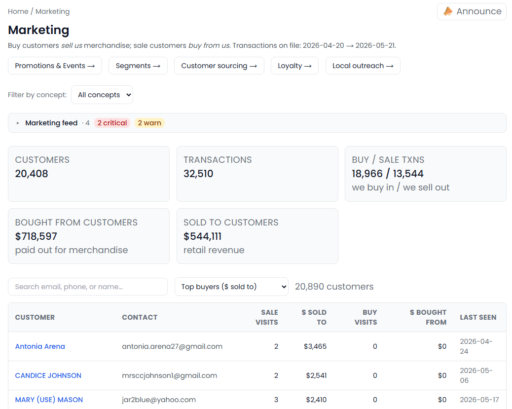
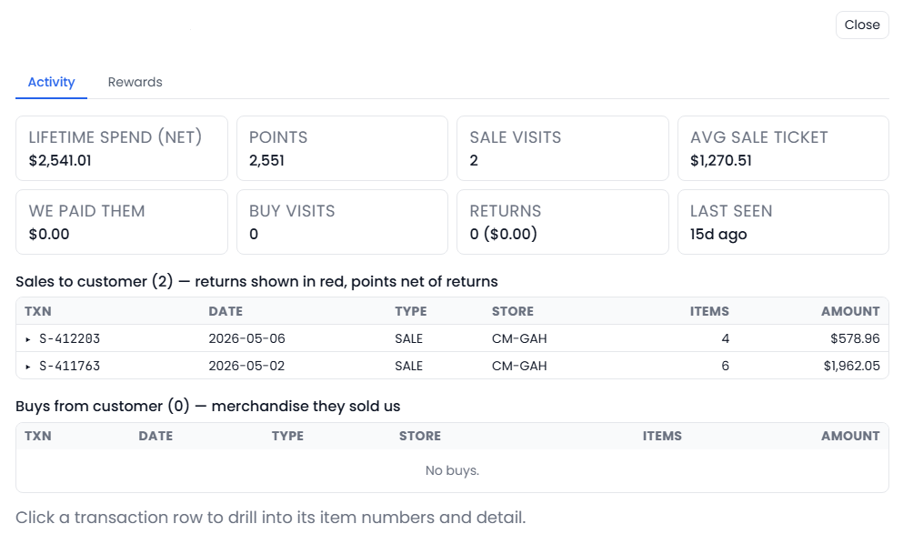
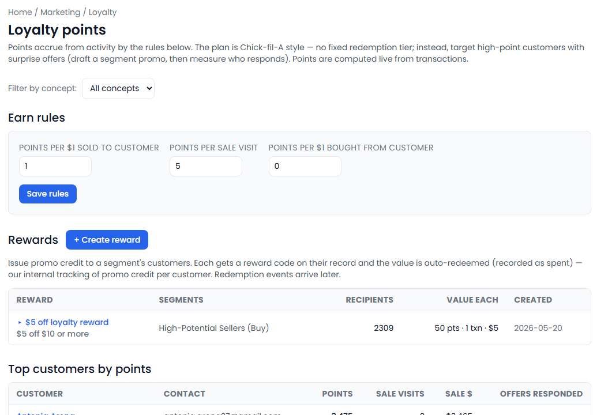
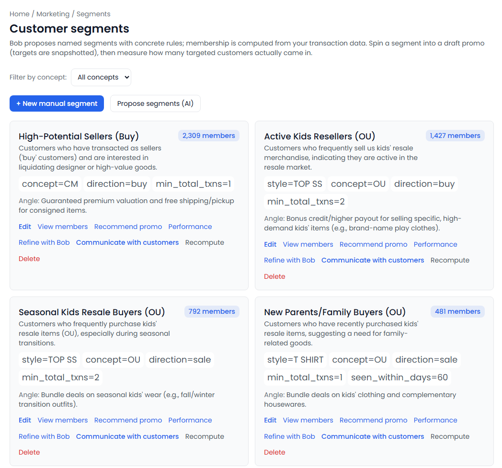
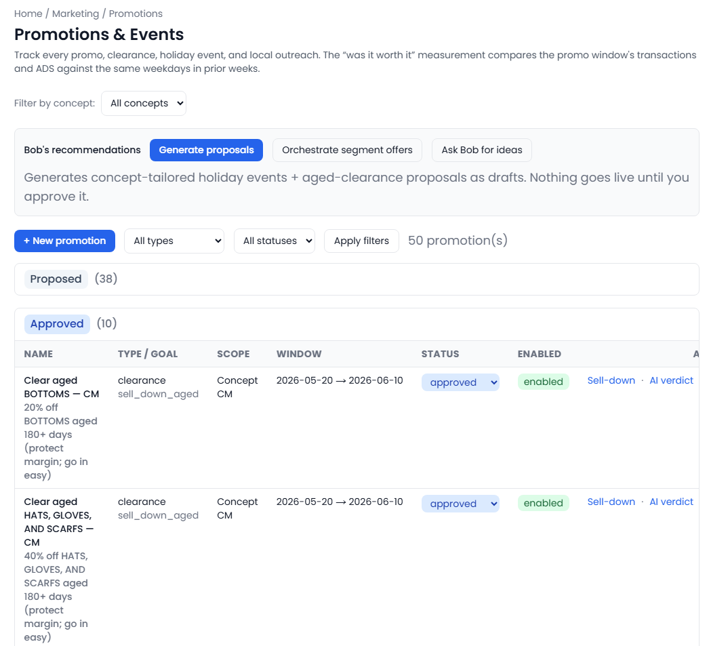
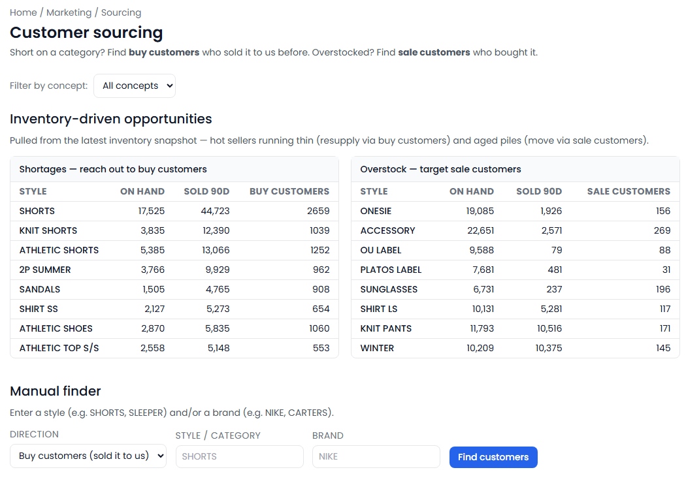

[← Back to overview](README.md)

# Marketing Boss

**Turn your transaction history into a marketing engine.**

> _Replaces / augments: Marketing manager + CRM + campaign analyst_

Most businesses are sitting on a goldmine they never use: the record of who bought what, when, and for how much. Marketing Boss builds a living customer database out of your everyday transactions, then helps you run loyalty, targeted promotions, win-back campaigns, neighborhood outreach, and inventory-driven customer sourcing — and judges, afterward, whether each campaign actually paid off. It **drafts; you approve.** Nothing goes out on its own.

---

## Everything it does

### A customer database that builds itself
- Assembles a **unified customer list automatically** from every sale and buy transaction — no manual data entry.
- Tracks per customer: **lifetime spend** (net of returns), visit count, returns, average ticket, and — for resale — **what you've paid them** for merchandise.
- **Search** by name, email, or phone; **sort** by spend, visits, or most recent visit; **filter** by store or brand.
- A **customer profile** for anyone, with every transaction drilled down to the individual items, plus their full rewards history.
- A headline dashboard: total customers, transactions, buy-vs-sale split, dollars paid out, and retail revenue.

### Loyalty & Rewards
A flexible loyalty program built for how *your* business actually rewards customers:
- **Points engine you control** — set points earned per dollar spent, per visit, and (for resale) per dollar of merchandise a customer sells you.
- **Surprise-and-delight model** — instead of rigid punch-card tiers, reward your best customers with targeted, unexpected offers (the "treat your regulars" approach).
- **Issue a reward to a whole segment in one move** — points, a free transaction, or a dollar credit — and every recipient gets a **unique, trackable reward code.**
- **Redemption tracking** — see how many rewards went out, how many were redeemed, and the exact store and transaction where each code was used.
- **Win back the unredeemed** — automatically re-contact customers holding an unused reward by email, text, and/or app notification.
- **Points leaderboard** — rank your top customers, including how many past offers each has responded to.
- **Per-customer rewards history** — every code a customer has been issued and whether it was redeemed.

### Customer segmentation
- **Build segments with simple rules** — store/brand, buyer vs. seller, minimum visits, minimum spend, recency ("seen / not seen in the last N days"), and even specific brands, styles, departments, or categories.
- **Let the AI propose segments** — ready-made, named groups that come with a built-in promotion angle.
- **See and recompute membership** any time, and edit any segment.
- **Turn a segment into a campaign in one click**, with the targeted customer list snapshotted so you can measure it.
- **Measure response** — how many targeted customers actually came in, and how much they spent — per campaign and across all of a segment's campaigns.
- **Refine on results** — tighten a segment based on who actually responded.
- **Reach a segment** by email, text, and/or app notification, in the priority order you choose.
- A built-in **win-back list** of lapsed repeat customers.

### B2B customers, kept separate
- **Automatically flags wholesale and institutional accounts** (schools, churches, counties, resellers) so they don't pollute your consumer marketing.
- A **reviewable B2B list** with the reason each was flagged — with one-click "not B2B" override and manual flagging.
- B2B accounts are **automatically excluded** from segments, loyalty, sourcing, and win-back.

### Local outreach
- An **AI finder that searches the real web** around any city or zip code (with an adjustable radius) for community venues, schools, leagues, churches, festivals, and events.
- Each opportunity is **matched to the right store**, with a **"why it fits" note**, a **suggested approach** (donate a coupon, sponsor, set up a table), and a **source link**.
- **One click turns an opportunity into a tracked outreach campaign.**

### Promotions
- **Create and manage** promotions, events, clearances, and outreach campaigns — scoped to one store, a brand, or all stores — with goals, dates, mechanics, discount, coupon code, and cost.
- **Approval workflow** — every promotion starts as a draft and moves through proposed → approved → active → completed.
- **AI-generated proposals** — automatic drafts for upcoming holidays and aged-stock clearances, tailored to each store concept.
- **"Ask for ideas"** — concept- and goal-specific suggestions that learn from what worked before and avoid clashing with your other plans.
- **"Was it worth it?" measurement** — compares the promotion window against the same weekdays in prior weeks (traffic, sales, average-ticket lift), with an after-the-fact view.
- **Clearance sell-down** — shows how much aged stock actually moved.
- **Plain-language AI verdict** on whether each promotion succeeded and why — remembered to sharpen future ideas.

### Sourcing
- **Find the exact customers tied to a brand or style** — the people who *sold* you that item (reach out when you're short) or who *bought* it (target when you're overstocked).
- An **inventory-driven opportunity list** pairing hot, low-stock items with sellers to source from, and aged or overstocked items with the customers who buy that category.

---

## What you'll see

> _Screenshot: `/marketing` home — headline tiles, the searchable customer table, and the activity feed._

> _Screenshot: a customer profile — lifetime spend and visits, every transaction drilled down to items, and rewards history._

> _Screenshot: the loyalty program — the points-earning rules, the rewards creator with redemption tracking, and the top-customer leaderboard._

> _Screenshot: the segment builder and list, with the win-back and B2B panels._

> _Screenshot: local outreach — a radius search returning community opportunity cards, each with a "why it fits" note and a create-campaign button._

> _Screenshot: promotions — AI-proposed campaigns, the status board, and the "was it worth it?" measurement with the AI verdict._

> _Screenshot: sourcing — find the customers who bought or sold a given brand or style._

---

## Decisions it puts in front of you

- "These 240 lapsed regulars haven't been in for 90 days — here's a win-back offer, ready to send."
- "There's a school fundraiser two miles from your Grove store next month — here's why it fits and how to approach them."
- "Last weekend's clearance moved $6,300 of aged stock and lifted average ticket 12% — it was worth it."
- "You're short on this brand — here are the customers who've sold it to you before."

---
[← Labor Planner](labor-planning.md) · [Back to overview](README.md) · [Next: Inventory Boss →](inventory-boss.md)
