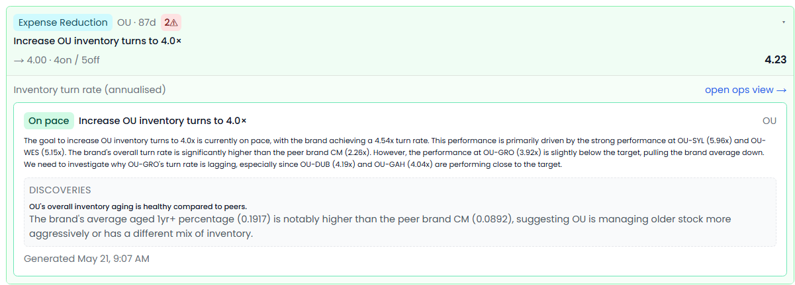
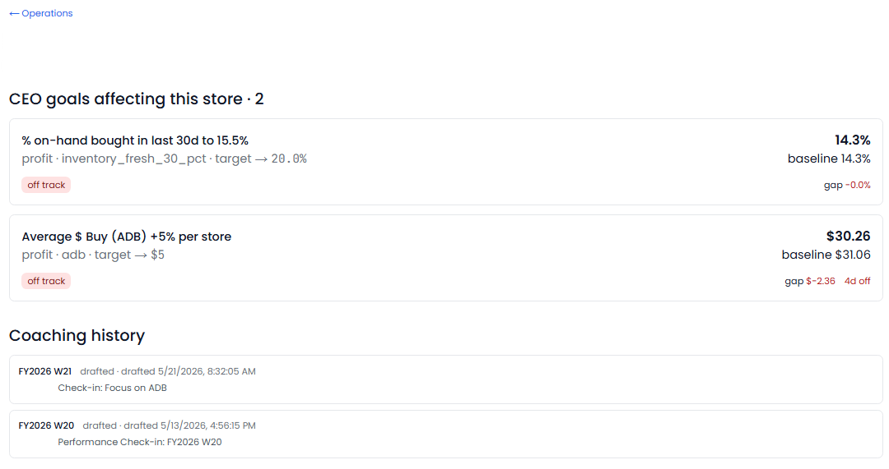
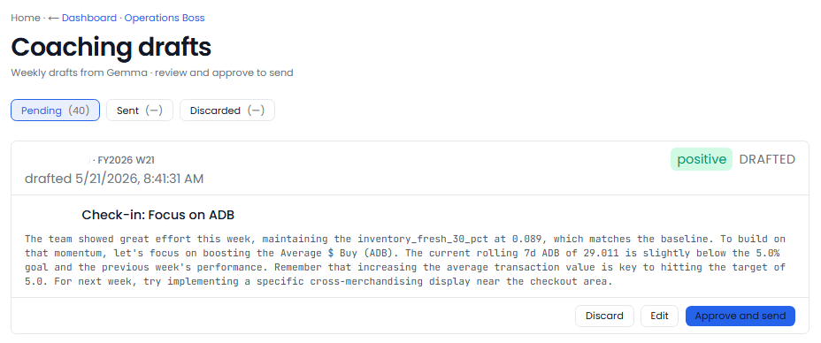

[← Back to overview](README.md)

# Operations Boss

**A coach for every location, every week.**

> _Replaces / augments: Operations manager + store-level coach_

Improving store performance means setting the right goals, tracking them honestly, and giving each manager specific, encouraging feedback — week after week, store after store. Operations Boss does all three automatically, and never sends a coaching note that reads like a corporate form letter.

---

## Everything it does

### Sets goals people can actually hit
- Each quarter, it looks at every store and **proposes one or two goals** worth focusing on — not blanket "do better" targets.
- It picks the areas where a store **trails its peers the most**, and sets a target **halfway to the peer median** — a stretch that's reachable, because a met goal builds momentum for the next.
- You **accept, adjust the target, set your own, or skip** each proposal.

### Tracks the metrics that actually run a store
It measures and tracks a full registry of retail KPIs, including:
- Net sales and average daily sales
- **Sales per labor hour**
- Items per sale, average unit price
- Discount %, coupon %, return %
- Buy-to-sale ratio, items per buy
- Gross margin
- Banking variance %, no-sale rate

### Watches progress every week
- Recomputes **every active goal's progress weekly**, with the actual number, the target, and percent attainment.
- Marks a goal **"met"** when a store hits target two weeks running.
- Flags a goal **"at risk"** when a store is below half its target for two weeks and getting worse — early, before quarter-end.

### Drafts coaching that lands
- Every week it **drafts a coaching note for each store** with an active goal.
- Each note **leads with what's going right**, then moves to one specific focus area.
- Every point is **backed by a real number**, not a vibe — and the tone is human, never robotic.
- Drafts wait in a queue; you **review, edit, and send** (nothing goes out on its own).

### Compares stores the right way
- Stores are measured **against their own brand's peers** — different price points and customer bases don't get lumped together, so the suggestions are actually actionable.

### One place to see a store
- A per-store view brings together its **goals, weekly KPIs, and any open issues** from accounting, helpdesk, loss prevention, and labor — all in one place.

---

## What you'll see

> _Screenshot: `/operations` home — goals met, at-risk goals, the coaching-draft queue, and the store grid._

> _Screenshot: a single goal — weekly attainment over time and the store-vs-peer comparison band._

> _Screenshot: a store's full picture — active goals, the KPI grid, and open issues from every other Boss._

> _Screenshot: the coaching-draft queue — positive-first, evidence-backed notes ready to review and send._

---

## Decisions it puts in front of you

- "Store 7 hit its sales-per-hour goal two weeks running — here's a note to recognize the team."
- "This location is now at risk on its margin goal. Here's the coaching draft."
- "Proposed goals for next quarter, one or two per store — review and approve."

---
[← Loss Prevention Boss](loss-prevention-boss.md) · [Back to overview](README.md) · [Next: Strategy Boss →](strategy-boss.md)
