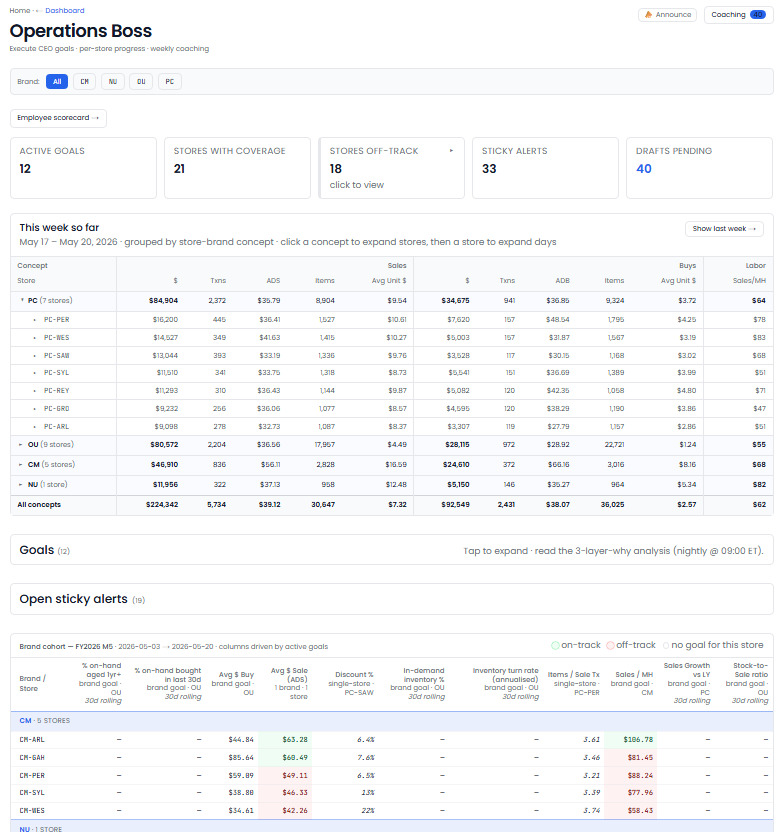

[← Back to overview](README.md)

# Operations Boss

**A coach for every location, every week.**

> _Replaces / augments: Operations manager + store-level coach_

Improving store performance means setting the right goals, tracking them honestly, and giving managers specific, encouraging feedback — week after week. Operations Boss does all three, for every location, automatically.

## What it does for you

- **Sets goals people can actually hit.** Rather than arbitrary targets, it proposes one or two reachable goals per store — closing a realistic part of the gap to the best performers.
- **Tracks progress every week.** Goals move through clear states — on track, met, or at-risk — so nothing quietly slips.
- **Drafts coaching that lands.** Each week it writes manager feedback that leads with what's going well, backs every point with real numbers, and sounds like a person — not a robot.
- **Watches the metrics that drive the business:** sales per labor hour, average sale, margin, discount rate, buy-to-sale ratio, and more.
- **Flags trouble early.** When a store starts slipping against its goal, it's surfaced before it becomes a quarter-end surprise.

## What you'll see

> _Screenshot: Operations Boss — per-store goals, weekly progress, and drafted coaching notes._

## Decisions it puts in front of you

- "Store 7 hit its sales-per-hour goal two weeks running — here's a drafted note to recognize the team."
- "This location is now at-risk on its margin goal. Here's the coaching draft."
- "Proposed Q3 goals for each store — review and approve."

---
[← Loss Prevention Boss](loss-prevention-boss.md) · [Back to overview](README.md) · [Next: Strategy Boss →](strategy-boss.md)
