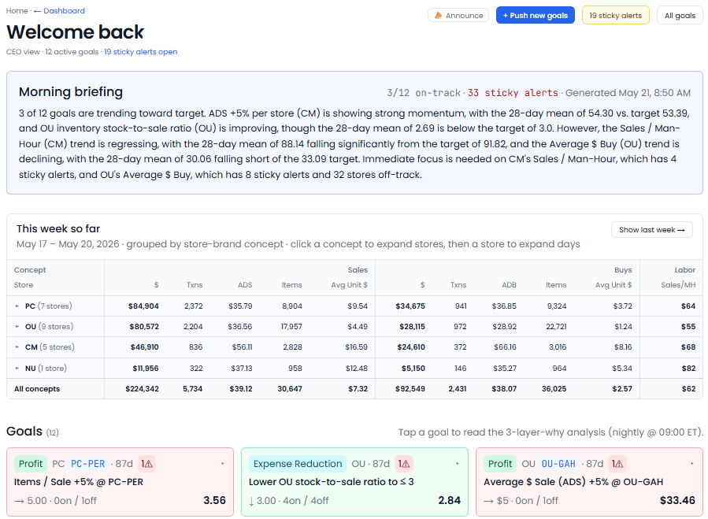
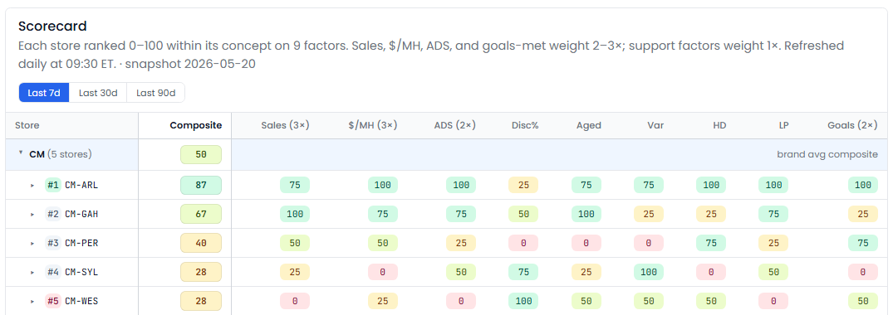
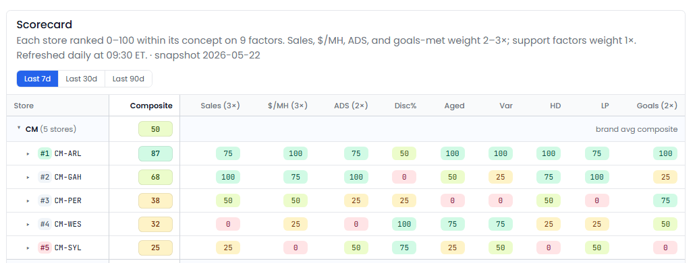
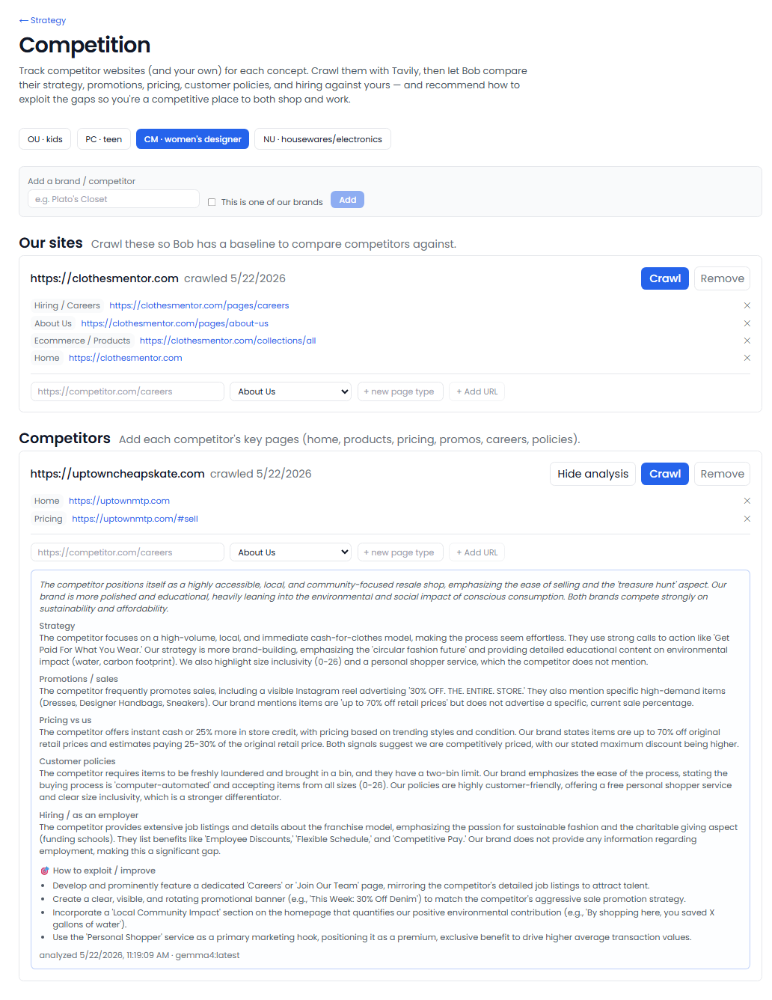
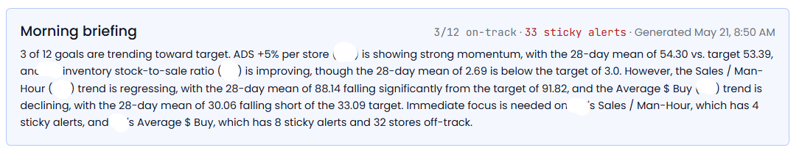
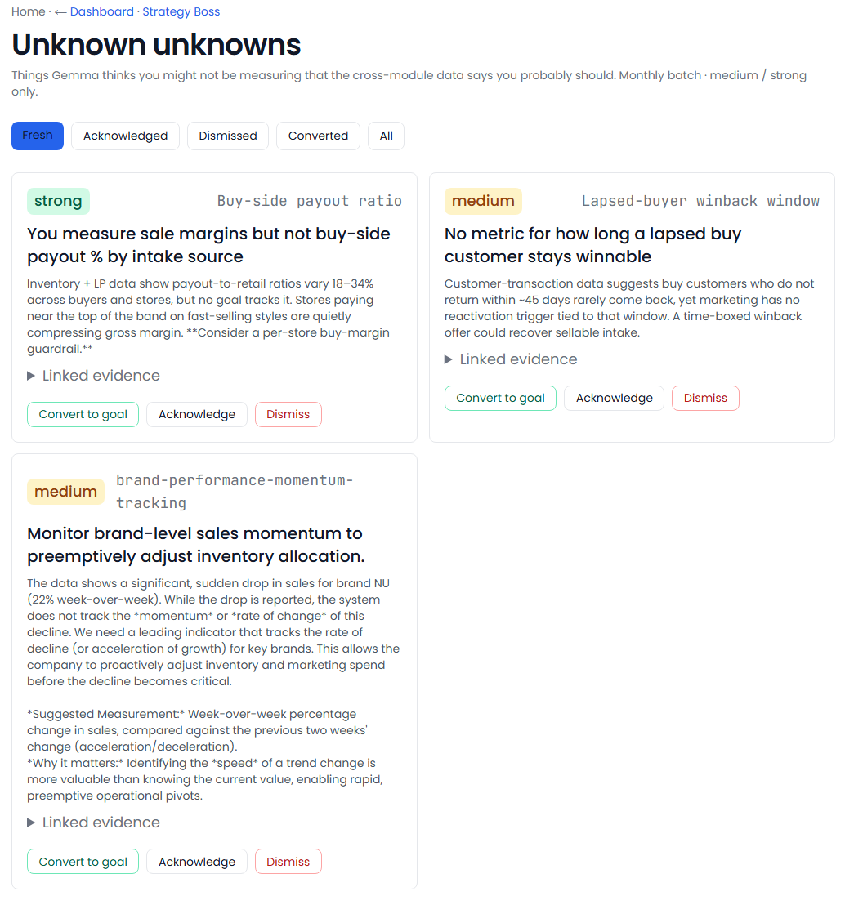

[← Back to overview](README.md)

# Strategy Boss

**The view from 30,000 feet — and the analyst behind it.**

> _Replaces / augments: Chief strategist + CEO scoreboard + embedded data analyst_

The hardest part of running a multi-location business is seeing the whole board at once: which risks are building, which brands are pulling ahead, and the problems you don't even know to look for. Strategy Boss is the one place that watches everything the other Bosses see and distills it into a clear, ranked picture for leadership. It's also your **data analyst** — keeping every number current, answering questions in plain English, and writing a one-page brief on the whole business every morning.

---

## Everything it does

### Scans the whole business for risk — weekly
Once a week it sweeps every other Boss for risk-shaped conditions and pulls them into a single ranked feed:
- **Aging financial variances** still open after two weeks
- **Chronic helpdesk issues** that won't go away
- **High-severity loss-prevention cases**
- **Untriaged software bugs**
- **Dormant job postings** that are still open
- **Store health-check failures**
- **At-risk operations goals**
- **Stale QuickBooks books**

Each risk is **ranked by severity** and ages up over time. You can acknowledge a risk (silence it without closing it) or resolve it — and anything that quietly clears itself drops off automatically.

### Scores and ranks your brands
- Computes a **single composite score per brand** each month, blending goal attainment, the share of stores hitting their targets, and a penalty for unresolved risk.
- **Ranks your brands against each other**, with the change since last period — your CEO scoreboard at a glance.

### Scores every store
- Ranks every store within its brand on a **single 0–100 scorecard** built from nine factors: sales, sales per labor hour, average sale, discounting, aged inventory, cash variances, helpdesk tickets, loss-prevention cases, and goals met — with sales weighted most.
- Switch between **7-, 30-, and 90-day** windows, and **click any score** to see the numbers behind it.

### Scans your competition
- **Track competitors brand by brand** — add each one's key pages (homepage, promotions, policies, careers), and add **your own sites alongside** as the comparison baseline.
- **Crawls their public pages automatically** — on demand or on a daily schedule — *politely, through a third-party crawler*, so your own network never touches their site and there's no blacklisting risk.
- The AI then **compares them directly against you** and writes up:
  - **Strategy & positioning** — what they're going for, and what you can learn from it.
  - **Promotions** — any active sales or discounts it can spot on their site.
  - **Pricing** — how their pricing signals stack up against yours.
  - **Policies** — returns, buying, membership — and whether yours are more or less customer-friendly.
  - **Hiring** — how they recruit and what they advertise, so you know if you're competitive as a place to *work*.
  - **Recommendations** — concrete moves to exploit the gaps.
- Results are **saved and shown instantly** on your next visit — no waiting on a re-scan.
- Connects in seconds with a free web-search key entered once.

### Sets the next big goals
- Each quarter it **proposes a few strategic goals per brand**, grounded in that brand's actual results and the cross-business picture — focused on existing-store performance, not vague growth.
- Tracks each strategic goal's progress on a longer cadence, marking them met or at-risk.
- You **accept, edit, or dismiss** every proposal.

### Surfaces the blind spots
- Once a month it runs an **"unknown unknowns" sweep** — surfacing 5–8 strategic blind spots the data hints at but no single Boss is tracking. For example:
  - "Two stores in the same brand are raising discounts in parallel — competitive pressure?"
  - "Average sale has been flat for 90 days while item count grew 8% — pricing erosion?"
  - "Buy-to-sale ratio is up across the portfolio — inventory aging?"
- Strong signals can be **promoted into an operations goal** with one click; the rest you dismiss.

### Keeps every number current — and watches for what's off
- Rebuilds your performance views **every night** across stores, brands, and employees, with fiscal-aware last-year comparisons — so your dashboards open instantly and already current.
- Automatically watches for what no one put on a dashboard: **outliers**, building **trends**, **threshold crossings**, **cross-team signals** (like a store that's busy but understaffed), and **funnel drop-offs**.
- Each finding comes with a headline, a recommendation, a severity, and a confidence — and respects the things you've already dismissed.

### Answers questions in plain English
- A **question box** where anyone can ask — *"What was sales by brand last week?"* — and get an answer drawn **only from your real data**, with the underlying table shown alongside.
- Built on a **curated set of trusted questions**, so answers are reliable rather than made up — and it keeps a history of what's been asked.

### Writes a daily executive brief
- Every morning, a **one-page "state of the business"** — per-team strengths, watch lists, suggested goals, and emerging cross-team trends.
- A rotating **insight ticker** surfaces the day's top findings, and you can **pin** the charts and numbers you care about.

---

## What you'll see

> _Screenshot: `/strategy` home — the brand scoreboard, the ranked risk feed, and the month's blind-spot signals._

> _Screenshot: a single brand — its score history and every store with its goal, risk, and helpdesk stats._

> _Screenshot: the store scorecard — every store ranked 0–100 across nine factors, switchable by time window._

> _Screenshot: the competition scanner — a competitor's AI analysis vs. your own brand: strategy, promotions, pricing, policies, hiring, and recommended moves._

> _Screenshot: the full risk feed — every open risk by type and severity, with acknowledge and resolve._

> _Screenshot: the monthly blind-spot signals, each with a strength rating and a promote-to-goal action._

> _Screenshot: the morning executive brief — per-team strengths, watch lists, and emerging trends, with the insight ticker._

> _Screenshot: the plain-English question box — a typed question, the answer, and the underlying data table._

---

## Decisions it puts in front of you

- "Your three highest risks this week, ranked — and why each one matters."
- "Here's this morning's executive summary across every team."
- "You asked how the brand compares to last year — here's the answer, with the numbers."
- "Brand A's score dropped 6 points this month — here's what's behind it."
- "Proposed strategic goals for next quarter — review and approve."

---
[← Operations Boss](operations-boss.md) · [Back to overview](README.md) · [Next: Labor Planner →](labor-planning.md)
